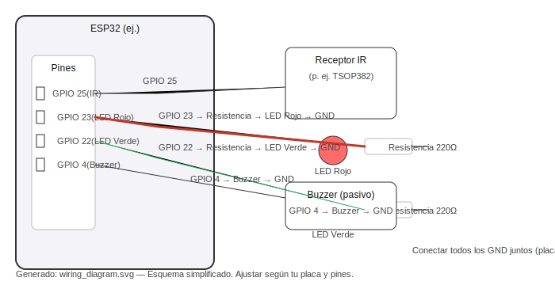
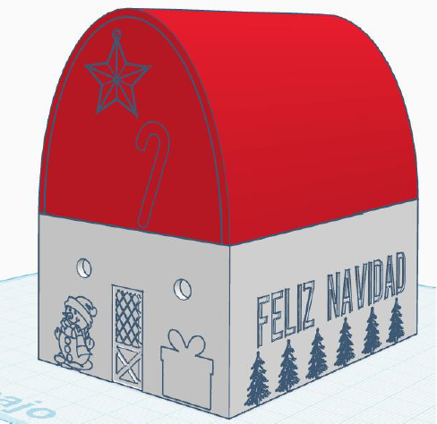

## Proyecto: Casa de Navidad (control por IR)

### Descripción

Este proyecto convierte una placa Arduino/ESP32 en una "casa de Navidad" que, al recibir una señal por infrarrojos desde un mando, enciende dos LEDs decorativos y reproduce un villancico con un buzzer. El control es instantáneo: un botón del mando activa las luces y la melodía, y otro botón apaga todo.

### Comportamiento principal
- Al pulsar el botón definido como `BOTON_ENCENDER` en el mando (código 0x18):
  - Se encienden dos LEDs (Luz 1 y Luz 2).
  - Comienza la reproducción de una melodía (bucle continuo).
- Al pulsar el botón `BOTON_APAGAR` (código 0x0C):
  - Se apagan los LEDs.
  - Se silencia el buzzer y la melodía se detiene.

### Archivo principal
- `PROYECTOCOMPLETOCASA.ino`: sketch de Arduino con la lógica IR, control de LEDs y reproducción de la melodía sin bloqueo.

### Hardware requerido
- Placa: ESP32 (recomendado) o otra compatible con `ledc` (p. ej. ESP32 Dev Module). Las definiciones de pines usadas en el código (25, 23, 22, 4) coinciden con pines típicos de ESP32.
- Receptor IR (p. ej. TSOP382, VS1838B).
- Mando a distancia IR (compatible con los códigos definidos o equivalente).
- 2 x LED (cualquier color) con resistencias de 220 Ω.
- Buzzer pasivo (se usa PWM para melodía). Si usas un buzzer activo, la reproducción de notas no funcionará igual.
- Cables y protoboard.

### Conexiones (según `PROYECTOCOMPLETOCASA.ino`)
- IR Receiver -> Pin 25 (definido como `IR_RECEIVE_PIN`)
- LED Rojo (Luz 1) -> Pin 23 (`LED_RED_PIN`) → resistencia 220 Ω → GND
- LED Verde (Luz 2) -> Pin 22 (`LED_GREEN_PIN`) → resistencia 220 Ω → GND
- Buzzer (pasivo) -> Pin 4 (`BUZZER_PIN`) → GND

Nota: Si tu placa no es ESP32, ajusta pines y la configuración de PWM según sea necesario.

### Diagrama de conexiones

A continuación tienes un diagrama simplificado de las conexiones. Ajusta los pines si tu placa difiere.

### Software y librerías
- Arduino IDE (o PlatformIO) con soporte para ESP32 si usas esa placa.
- Librería: `IRremote` (incluir desde el Gestor de Librerías de Arduino o instalar manualmente). El sketch incluye `#include <IRremote.h>`.

### Cómo cargar y ejecutar
1. Abre `PROYECTOCOMPLETOCASA.ino` en Arduino IDE.
2. En el IDE selecciona la placa correcta (p. ej. "ESP32 Dev Module") y el puerto COM correspondiente.
3. Instala la librería `IRremote` si no está instalada:
   - En Arduino IDE: Programa → Incluir Librería → Administrar Bibliotecas… → buscar "IRremote" e instalar.
4. Compila y sube el sketch a la placa.
5. Abre el Monitor Serie (115200 baudios) para ver mensajes de estado cuando pulses los botones del mando.

### Uso
- Pulsa el botón del mando que envía el código 0x18 (definido en el código como `BOTON_ENCENDER`) para encender las dos luces y que empiece la melodía.
- Pulsa el botón que envía 0x0C (`BOTON_APAGAR`) para apagar las luces y detener la melodía.

Si tu mando usa otros códigos, puedes identificar los códigos recibidos modificando temporalmente el sketch para imprimir `IrReceiver.decodedIRData.command` (o habilitando más salida por Serial) y pulsando los botones para ver sus valores.

### Notas y recomendaciones
- Asegúrate de usar un buzzer pasivo si quieres reproducir notas; un buzzer activo solo emite un tono fijo cuando se alimenta.
- Usa resistencias (220 Ω) en los LEDs para limitar corriente.
- Si la melodía suena muy baja o con distorsión, revisa alimentación y conexiones del buzzer.
- Para usar un mando distinto, actualiza los defines `BOTON_ENCENDER` y `BOTON_APAGAR` con los códigos correctos.

### Solución de problemas
- No se reciben señales IR: comprueba la conexión del receptor, la alimentación y que el receptor esté orientado hacia el mando. Prueba el receptor con otra placa o con un receptor conocido.
- LEDs no encienden: revisa polaridad del LED y que la resistencia no esté en corto. Verifica que la placa esté ejecutando el sketch (mensajes en Serial).
- Melodía no suena: comprueba que el buzzer sea pasivo y que el pin asignado (4) esté correctamente conectado. Asegúrate de que la placa soporte la API `ledc` (ESP32).

### Autor y licencia
- Autor: (tu nombre)
- Licencia: Libre para uso educativo (modifica según prefieras).

---

Si quieres, puedo también:
- Generar un diagrama de conexión simple (ASCII o imagen) basado en las conexiones anteriores.
- Añadir instrucciones para detectar los códigos del mando desde el sketch y cómo cambiarlos.
